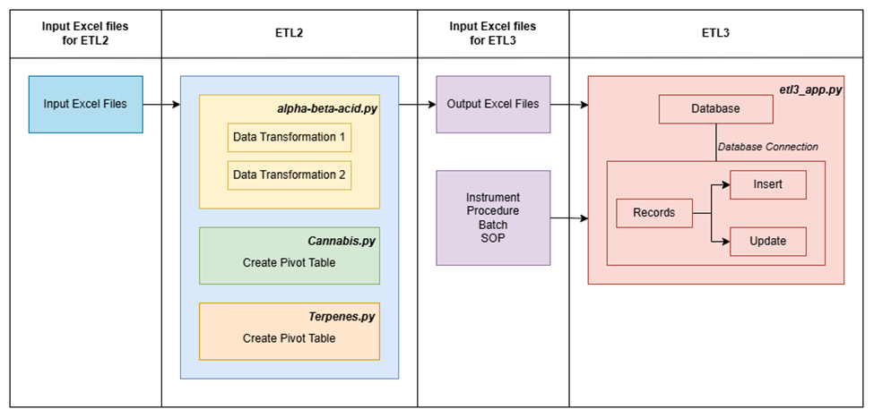

# ARC-General_Automation

This project is aim to design and implement ETL pipelines to process chemical analysis data from lab instruments, automating the transformation of raw excel files into structured datasets. In this project, the terms alpha beta acids, and terpenes refer to chemical compounds naturally found in the flower cones of the hops plant (Humulus lupulus). These compounds are responsible for the bitterness, aroma, and flavor characteristics of hops, and are central to the analysis and objectives of this work.

## Data Transformation (ETL2 & ETL3) for chemicals

### Context

This application is intended to be used for two main processes: ETL2 and ETL3. The first process, ETL2, is used for the data modification and transformation of Alpha-Beta-Acid, Cannabis, and Terpenes to ensure that the quantifying data received from HPLC and GCMS ready to be stored in database for future analysis. The Alpha-Beta-Acid data undergoes two transformations, while Cannabis and Terpenes require only one.
After the data is modified and transformed during ETL2, the Excel files are used in the ETL3 process. ETL3 uses the transformed Alpha-Beta-Acid, Cannabis, and Terpenes data to retrieve sample names and chemical components. Additionally, information about instruments, procedures, batches, and SOPs is extracted from separate Excel files and used to either insert missing data into the database or update existing records.

### Application Logic - General Architecture

The application architecture consists of two main ETL processes: ETL2 and ETL3, designed to process and prepare chemical data specifically Alpha-Beta-Acid, Cannabis, and Terpenes for structured storage in a PostgreSQL database. The architecture ensures systematic data transformation, validation, and enrichment using a modular and scalable design.

All work presented here was conducted as part of an applied research initiative at the Applied Research Centre of Langara College.